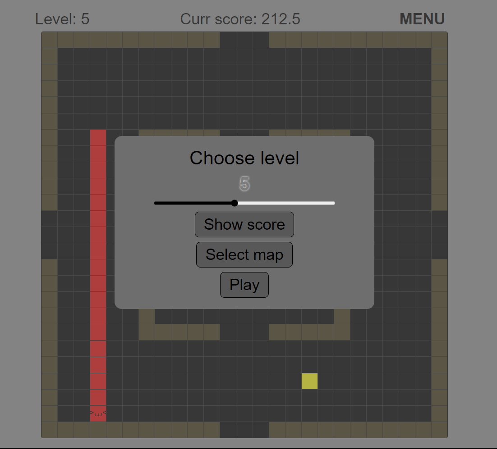

#Змейка на React с TypeScript

## Описание игры
Игра "Змейка" - это классическая аркадная игра, реализованная с использованием современных технологий React и TypeScript. Игрок управляет змейкой, которая движется по виртуальному полю, собирая еду и избегая препятствий.

### Логика игры: 
В основе игры лежит виртуальное поле, игровое поле отрисованное по виртуальному состоящее из клеток, и управляющий компонент, который отвечает за игровую логику. Управляющий компонент выполняет следующие функции:
- Расчеты и обновления: Каждые несколько миллисекунд компонент производит расчеты для определения положения змейки, еды и препятствий, а затем перерисовывает главные компоненты игры.
- Виртуальное поле: Состоит из двумерного массива состоящего из двух типов данных. Один отвечает за клетку препятствие, второй за пустую клетку.
- Игровое поле: Отрисовывается с помощью виртуального поля. Отображается в виде сетки, где каждая ячейка представляет собой отдельную клетку. Змейка и еда визуализируются с помощью плиток, наложенных на эти клетки.
- Препятствия: На поле могут присутствовать препятствия, которые представляют собой измененные ячейки. Игрок должен избегать столкновения со стенами и препятствиями, чтобы игра продолжалась.

### Управление:
Игрок управляет змейкой с помощью стрелок на клавиатуре:

-  Стрелка вверх: Двигает змейку вверх.
-  Стрелка вниз: Двигает змейку вниз.
-  Стрелка влево: Двигает змейку влево.
-  Стрелка вправо: Двигает змейку вправо.
Каждый раз, когда змейка собирает еду, она увеличивается в размере, что усложняет управление.

### Интерфейс:
В игре "Змейка" предусмотрены различные настройки, которые позволяют игрокам адаптировать игровой процесс под свои предпочтения:

- **Выбор уровня**: Игроки могут выбрать уровень сложности от первого до десятого. Каждый уровень определяет скорость движения змейки и количество очков, получаемых за каждую собранную единицу еды. С увеличением уровня, игра становится более динамичной и сложной.

- **Выбор карты**: Игроки могут выбирать различные карты, каждая из которых имеет уникальные особенности и элементы дизайна. Выбранная карта также влияет на множитель очков.

- **Локальная таблица рекордов**: Игра включает локальную таблицу рекордов, которая сохраняет достижения игроков с использованием локального хранилища браузера.

* [Project link](https://mysnake2d.netlify.app/)


## Требования
- [Node.js](https://nodejs.org/) (рекомендуемая версия: 21.x или выше)
- [npm](https://www.npmjs.com/) (обычно устанавливается вместе с Node.js)
- [Git](https://git-scm.com/) (для клонирования репозитория)

## Установка
Выполните следующие действия, чтобы установить и запустить проект:

1. **Клонируйте репозиторий**:
  ```bash
  git clone https://github.com/bidzyu/mysnake.git
  ```

2. **Перейдите в каталог проекта**:
  `cd weather_now`

3. **Установите зависимости**:
  `npm install`

4. **Запустите проект в режиме разработки**:
  `npm run dev`

## Скрипты

-  `npm run dev` — Запускает проект в режиме разработки с помощью Vite.
-  `npm run build` — Компилирует проект с помощью TypeScript и создает сборку с помощью Vite.
-  `npm run lint` — Проверяет код на наличие ошибок с помощью ESLint.
-  `npm run preview` — Предварительный просмотр сборки проекта.

## Ссылки

- [Vite](https://vite.dev/guide/).
- [React](https://react.dev).
- [TypeScript](https://www.typescriptlang.org/docs/).
- [Redux toolkit](https://redux-toolkit.js.org/).
